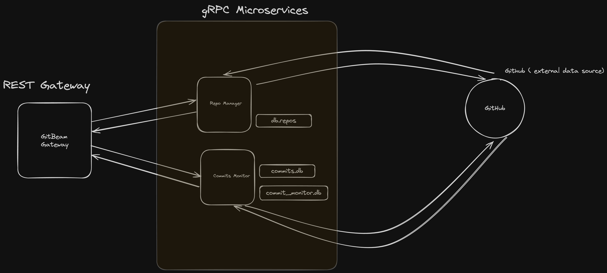
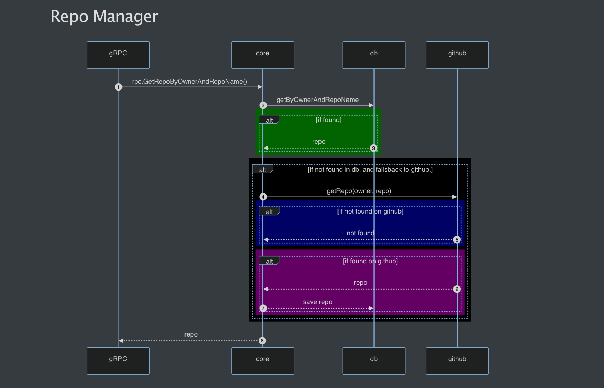
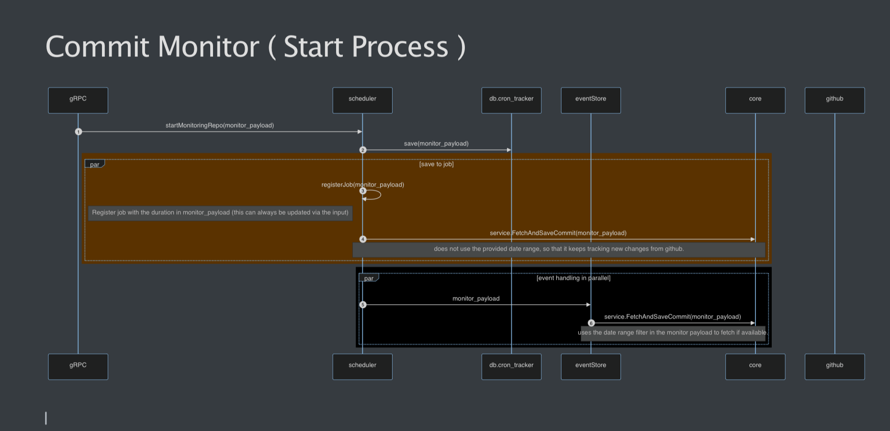

# GitBeam

A service that pulls commits from github repo periodically. ( for this exercise it periodically pulls every x period of
time. )

Dependencies

- Go 1.24
- Sqlite DB
- Chi Router v5 ( as pure as net/http )
- gRPC

#### System codebase breakdown

> Gateway: https://github.com/Just4Ease/gitbeam

> Repo Manager Microservice: https://github.com/Just4Ease/gitbeam.repo.manager

> Commit Monitor Microservice: https://github.com/Just4Ease/gitbeam.commit.monitor

> Base Lib: https://github.com/Just4Ease/gitbeam.baselib

### How to start the service.

#### Clone this repository, and run the command below.

* Ensure you have docker running on your computer.

```shell
git clone https://github.com/Just4Ease/gitbeam
cd gitbeam
./setup.sh # if you use a windows PC, use GitBash to run the setup script.

  
```
Import the [Git Beam.postman_collection.json](GitBeam.postman_collection.json) into postman to see the endpoints for the service.
### How to test the service

```shell
cd gitbeam
make test

# or
cd gitbeam
go test -v ./... -cover
```

- Gateway runs on Port 8080 ( http://localhost:8080 )
- Repo Manager Microservice runs on port 8001
- Commit Monitor Microservice runs on port 8002


#### Notes on the commit monitor.
* ###### To start monitoring commits
```json
// POST /commits/start-monitoring
{
  "repoName": "chromium",
  "ownerName": "chromium",
  "durationInHours": 1,
  "fromDate": "2024-07-01",
  "toDate": "2024-07-23"
}
```

- The payload above is used to instruct the commit monitor on how to pull commits from a Git repository.
- `durationInHours`: This field sets the interval (in hours) for pulling/monitoring commits from the Git repository. It can be updated at any time to change the scheduler interval. ( minimum value is 1 ) 
- `fromDate` and `toDate` are optional fields. They specify the timeline for pulling commits from the Git commit history. After retrieving the commits within this timeline, the commit monitor will continue to track the latest changes in the Git repository.
---

* ###### To stop monitoring commits
```json
// POST /commits/stop-monitoring

{
  "repoName": "chromium",
  "ownerName": "chromium"
}
```
### Video Demo of how it works.

[Click Here To Watch Video Demo: https://drive.google.com/file/d/1R8E0pVdYpNkQ2dzXLC0y_zYEXCzRTUNS/view?usp=sharing](https://drive.google.com/file/d/1R8E0pVdYpNkQ2dzXLC0y_zYEXCzRTUNS/view?usp=sharing)


## I've attached the following system architecture and sequence diagrams below.

### System Architecture Diagram



---

### Repo Manager Workflow Diagram



---

### Commit Monitor Workflow Diagram



I'm looking forward to hearing your feedback. 🚀
Kind Regards.