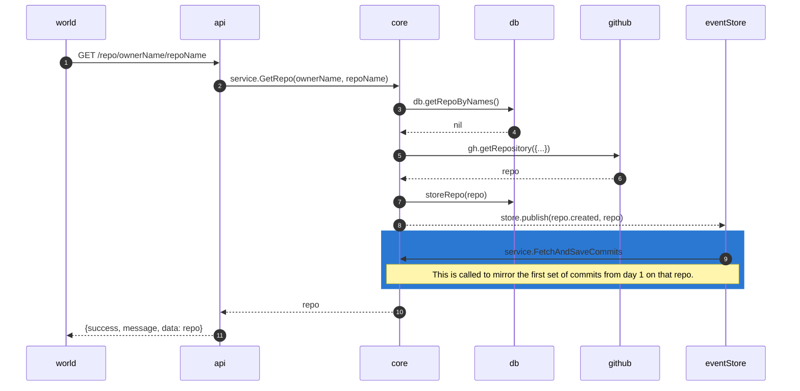

## Getting initial set of commits on getting and saving the repository from Github.

## Start Beaming - To tell the system to periodically check for commits.

```mermaid
sequenceDiagram;
autonumber;
participant world
participant api
participant cronService
participant db
participant eventStore
participant core


world ->> api: POST /commits/start-beaming 
Note over world, api: ({ ownerName, repoName, fromDate?, toDate? })
api ->> cronService: cronStore.SaveCronTracker(data)
cronService ->> db: db.SaveCronTracker(data)
db -->> cronService: saved data
cronService -->> eventStore: store.pub("cron.tracker.created", data)
Note over cronService, eventStore: After saving the data in the cron tracker table
rect rgb(10, 10, 10)
par background activity
eventStore ->> core: service.FetchAndSaveCommits(data)
Note over eventStore, core: fetch commits instantly before cron job's next tick.
end
end
cronService -->> api: data 
rect rgb(100, 100, 10)
par cronService activity
cronService ->> db: listCronTrackers()
Note over cronService, db: periodically, check db for repos we need to get commits for.
db -->> cronService: [tasks]
cronService -->> core: service.FetchAndSaveCommits(task)
Note over cronService, core: trigger a go routine that will fetch the commits for each repo task.
end
end
api -->> world: {success, message, data}
```

## Stop Beaming - To stop tracking new commits for a repo

```mermaid
sequenceDiagram;
autonumber;
participant world
participant api
participant cronService
participant db
participant eventStore

rect rgb(10, 10, 10)
world ->> api: POST /commits/stop-beaming 
Note over world, api: ({ ownerName, repoName })
api ->> cronService: cronStore.DeleteCronTracker(data)
cronService ->> db: db.DeleteCronTracker(data)
db -->> cronService: deleted_data
cronService -->> eventStore: store.pub("cron.tracker.deleted", deleted_data)
Note over cronService, eventStore: This event can be stored in an audit/event log.
cronService -->> api: bool

api -->> world: {success, message: "Successfully stopped mirroring commits"}
end
```

